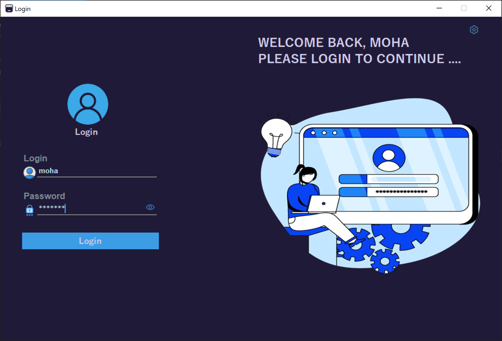

# Shop-Management-Project

This is a Python application for managing invoices and transaction history. It provides a graphical user interface built using Tkinter library.

## Prerequisites

- Python 3.x
- Tkinter
- PIL (Python Imaging Library)
- SQLite3

## Installation

1. Clone the repository:

```shell
git clone https://github.com/your-username/dashboard-application.git
```
2. Change the project directory:

```shell
cd Shop-Management-Project
```
3. Install the required dependencies:

```shell
pip install pillow
```
4. Run the dashboard.py script to start the application:

```shell
python dashboard.py
```

## Features

The Invoice Management System offers the following features:

### New Invoice
- Add a new invoice with customer details, item name, price, quantity, and salesperson information. This feature enables easy creation and recording of new transactions.

### Invoice History
- View transaction history and search for invoices by customer name, item name, or invoice number. This feature allows for quick retrieval and review of past transactions.

### Add Item
- Add new items to the database with details such as item name, description, quantity, price, and category. This feature enables you to easily expand and update your inventory with accurate information.

MIT License

Copyright (c) [2023] [Moha]

PROECTIGAN UU U FASAXANYAHAY QOF WALBA OO RABA IN UU ISTICMAALO AMA WAX KABADALO.

THE SOFTWARE IS PROVIDED "AS IS", WITHOUT WARRANTY OF ANY KIND, EXPRESS OR IMPLIED, INCLUDING BUT NOT LIMITED TO THE WARRANTIES OF MERCHANTABILITY FOR A PARTICULAR PURPOSE.


## Screenshots

---



---


---


